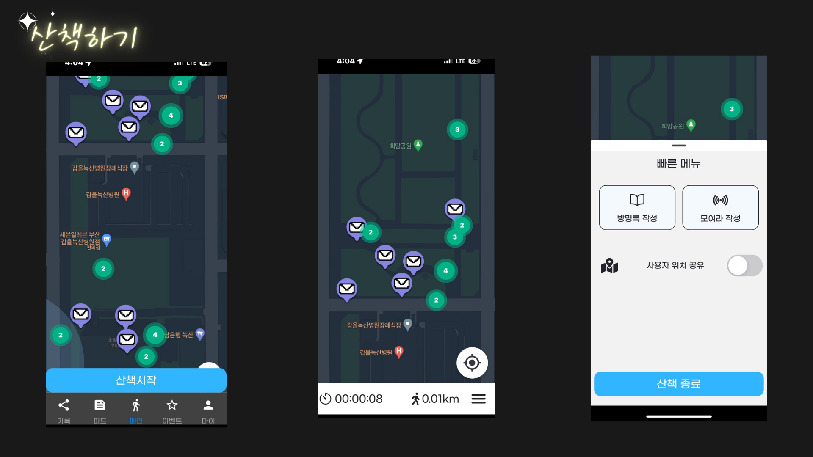
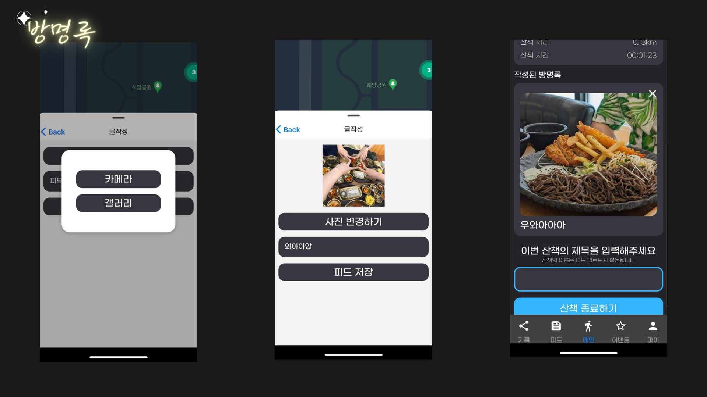
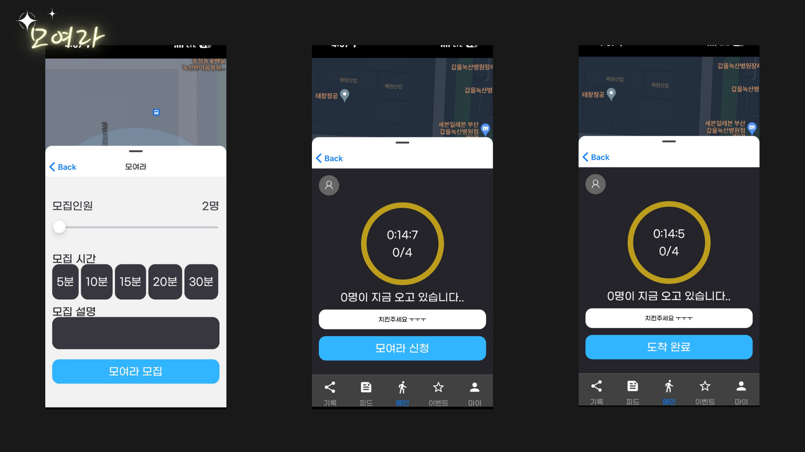
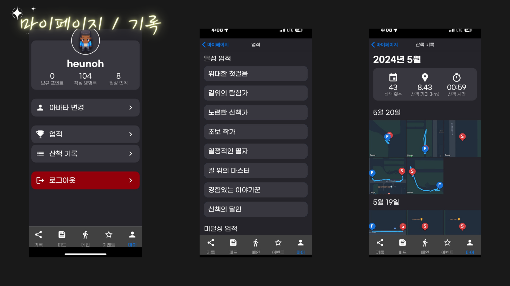
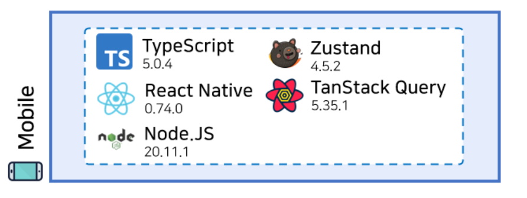
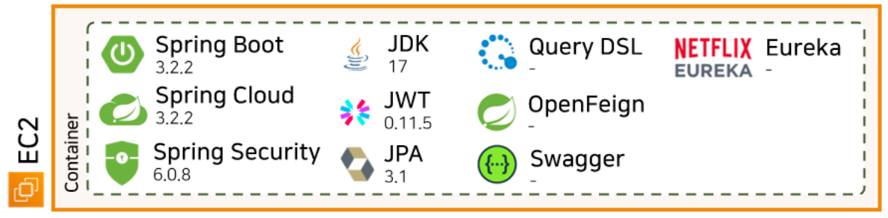
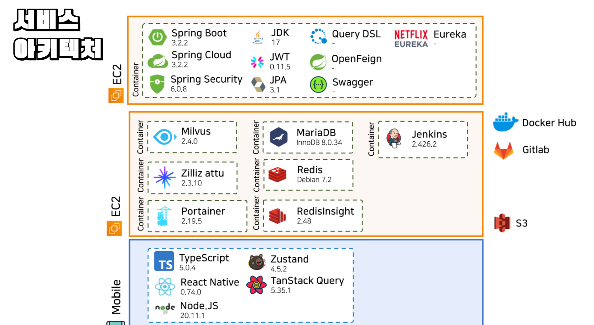

# SSAFY 10기 자율 프로젝트

<div align="center">
<br>
</img>

<br>

<h1> Connectus </h1>

 > 함께하며 연결되는 우리, 홀로 느꼈던 감정들을 Connectus와 함께 나눠보세요!


</div>

### 기능 소개
```
1. 산책하기
 - 산책 시작을 눌러 경로/거리/시간을 기록한다.
 - 산책완료 후 자신의 기록을 모아볼 수 있다.
```

</img>

```
2. 방명록
 - 산책도중 해당 위치에 글과 사진을 남길 수 있다.
 - 사용자는 자신의 100m 내의 방명록만 무료로 읽을 수 있다.
 - 방명록에는 댓글/좋아요가 가능하다.
```

</img>

```
3. 피드
 - 하나의 산책도중 남겨진 방명록을 피드라고 한다.
 - 사용자가 남긴 방명록을 실시간으로 볼 수 있다.
 - 방명록의 사진만이 보이고 모든 내용을 보기 위해서는 포인트를 이용해야한다.
 - 혹은 '보러가기' 기능을 통해 해당 방명록으로 산책을 나갈 수 있다.
```

</img>

```
4. 경로 공유
 - 자신의 산책 기록 중 마음에 드는 경로는 공유할 수 있다.
 - 사용자든 타인의 경로를 보고 따라가기 기능으로 따라갈 수 있다.
 - 따라가기 활성화시 해당 경로를 지도에 오버랩 시켜준다.
 - 얼마나 많은 사람이 해당 경로를 따라갔는지 카운트를 세어준다.
```


```
5. 모여라
 - 사용자는 특정 위치에서 모집인원/모집시간/내용을 작성해 사람을 모을 수 있다.
 - 모여라 참여자는 특정 거리에 다가와 참여확정을 눌러 모임에 참여할 수 있다.
```

</img>

```
6. 마이페이지
 - 아바타 변경, 작성글 목록 등 활동 이력 관리 기능을 담당한다.

7. 업적
 - 사용자가 활동한 이력을 기반으로 업적을 부여합니다.
 - 산책/모여라/방명록/이벤트 등에 대한 참여 지표를 기준으로 업적을 부여한다.

8. 기록 요약
 - 자신의 월간 기록과 상세 기록을 볼 수 있다.
 - 자신의 기록을 "경로 공유" 페이지에 공유할 수 있다.

```

</img>

<br><br>


### 기술적 특장점
```
[기획/설계]
 - 정석적 기술 설계 절차에 따른 서비스 기획
 - 기존 데이터 중심 DB 설계가 아닌, 서비스 중심 도메인 설계를 진행

[Infra]
 - 각 DB와 서비스가 독립적인 물리 공간을 차지하도록 배포
 - 서비스 단위 빌드 및 배포 진행
 - 모든 DB(Redis, Milvus)와 Docker Container에 대한 GUI 컨트롤러 지원
 - 역할에 따른 AWS IAM 권한 계정 생성 후 지급
 - 모든 서비스 도메인 연결 완료
 - 9개의 서비스에 대한 자동 배포 및 헬스체크

[Backend]
 - Hexagonal Architecture 기반의 유연한 Microservice 구현
 - API Gateway, Service Discovery를 구현하여 부하 분산 및 확장성 추구
 - request sanitization을 이용한, API 호출 프로세스 개선
 - Vector DB를 사용하여, 부하가 큰 API에 대한 성능 개선
 - 추후 작성
 

[Frontend]
 - React Native를 이용한 모든 모바일 기기 지원 (iOS, Android)
 - 리엑트 쿼리 전역적 관리 통일/재사용 사이드 이펙트 능동적
 - zustand를 통해 가볍고 빠른 전역 데이터 저장 및 조회
 - 중요한 유저 정보는 암호화 하여 저장
 ```

<br><br><br>


# 🐣 Frontend
<div align="center">

 > React Native 기반의 Application 개발

</img>

</div>

### 파일 구조
```
connectus
├── android
│   ├── app
│   │   └── src
│   │       ├── debug
│   │       └── main
│   │           ├── assets
│   │           │   └── fonts
│   │           ├── java
│   │           │   └── com
│   │           │       └── connectus
│   │           └── res
│   │               ├── drawable
│   │               ├── mipmap-hdpi
│   │               ├── mipmap-mdpi
│   │               ├── mipmap-xhdpi
│   │               ├── mipmap-xxhdpi
│   │               ├── mipmap-xxxhdpi
│   │               └── values
│   └── gradle
│       └── wrapper
├── assets
│   └── fonts
├── ios
│   ├── connectus
│   │   └── Images.xcassets
│   │       └── AppIcon.appiconset
│   ├── connectusTests
│   ├── connectus.xcodeproj
│   │   └── xcshareddata
│   │       └── xcschemes
│   └── connectus.xcworkspace
│       └── xcshareddata
├── src
│   ├── api
│   │   └── queries
│   ├── assets
│   │   └── markers
│   ├── components
│   │   ├── buttons
│   │   ├── containers
│   │   ├── event
│   │   ├── feed
│   │   ├── map
│   │   ├── my
│   │   ├── share
│   │   └── text
│   │       ├── body
│   │       ├── display
│   │       ├── headline
│   │       ├── label
│   │       └── title
│   ├── constants
│   ├── contexts
│   ├── hooks
│   ├── navigations
│   │   ├── root
│   │   ├── stack
│   │   └── Tabs
│   ├── screens
│   │   ├── auth
│   │   ├── event
│   │   ├── feed
│   │   ├── map
│   │   │   └── BottomSheet
│   │   ├── my
│   │   └── share
│   ├── store
│   ├── style
│   ├── types
│   └── utils
└── __tests__
```

<br><br>


### 실행 방법

#### 1) React Native 프로젝트 경로로 이동

```sh
cd frontend/connectus/
```

#### 2) 종속성 설치

```sh
npm ci
```

#### 3) Android 패키지 빌드

빌드 결과물인 앱 번들 (`.aab`) 파일을 `.apks` 파일로 변환하는 데 [Bundletool](https://github.com/google/bundletool)을 사용합니다

```sh
npx --yes react-native build-android --mode release
bundletool build-apks \
	--bundle android/app/build/outputs/bundle/release/app-release.aab \
	--output build/app-release.apks \
	--mode universal \
	--ks android/app/debug.keystore \
	--ks-key-alias androiddebugkey \
	--ks-pass pass:android
```

#### 4) APK 파일 준비

```sh
unzip -d "build" "build/app-release.apks" universal.apk
```

#### 5) APK 파일 설치

`universal.apk`를 설치합니다

```sh
adb install build/universal.apk
```

<br><br><br>


<h1> 🐹 Backend </h1>

<div align="center">

 > Spring Cloud를 통한 Spring Boot MSA 개발

</img>


</div>


<br>

<div align="center">

## 서비스 흐름

</img>

<table style="width:70%">
    <tr style="text-align: center;">
        <td>순번</td>
        <td>동작</td>
    </tr>
    <tr>
        <td  style="text-align: center;">[1]</td>
        <td>클라이언트의 접근,<br> Spring Cloud Gateway를 이용해 모든 요청에 대한 단일 진입점을 노출하였습니다.</td>
    </tr>
    <tr>
        <td style="text-align: center;">[2]</td>
        <td>Gateway는 Eureka 서비스에 요청</td>
    </tr>
    <tr>
        <td style="text-align: center;">[3]</td>
        <td>사용자의 접근 주소를 기준으로 선언 파일을 참조하여 접근할  Microservice에 대한 정보(포트 및 주소)를 반환</td>
    </tr>
    <tr>
        <td style="text-align: center;">[4]</td>
        <td>Gateway는 반환받은 정보를 통해 최종적으로 서비스에 접근</td>
    </tr>
</table>


<br><br>

## 서비스 구성

<table style="width:70%">
    <tr>
        <td>구성</td>
        <td>역할</td>
    </tr>
    <tr>
        <td>Spring Cloud</td>
        <td>분산 시스템을 구축하고 운영하기 위한 일련의 프레임워크와 라이브러리를 제공</td>
    </tr>
    <tr>
        <td>Netflex Eureka</td>
        <td>Microservice들의 주소, 포트, 연결 설정 값에 대해 정의하고 등록함</td>
    </tr>
    <tr>
        <td>Spring Boot</td>
        <td>각 Microservice에 대해 작성</td>
    </tr>
</table>


<br><br>

## 서비스 역할에 따른 포트 구성

</img>

<table style="width:70%">
    <tr>
        <td>번호</td>
        <td>서비스명</td>
        <td>포트</td>
        <td>비고</td>
    </tr>
    <tr>
        <td>1</td>
        <td>apigateway</td>
        <td>8000</td>
        <td>8761</td>
    </tr>
    <tr>
        <td>2</td>
        <td>discovery</td>
        <td>8761</td>
        <td>api.connectus.social:8761<br> 접근 시 탐색된 서비스 정보 확인 가능</td>
    </tr>
    <tr>
        <td>3</td>
        <td>post</td>
        <td>8101</td>
        <td>방명록</td>
    </tr>
    <tr>
        <td>4</td>
        <td>gather</td>
        <td>8102</td>
        <td>모여라</td>
    </tr>
    <tr>
        <td>5</td>
        <td>spot</td>
        <td>8103</td>
        <td>위치</td>
    </tr>
    <tr>
        <td>6</td>
        <td>chat</td>
        <td>8104</td>
        <td>채팅</td>
    </tr>
    <tr>
        <td>7</td>
        <td>event</td>
        <td>8105</td>
        <td>이벤트</td>
    </tr>
    <tr>
        <td>8</td>
        <td>walk</td>
        <td>8106</td>
        <td>산책</td>
    </tr>
    <tr>
        <td>9</td>
        <td>user</td>
        <td>8107</td>
        <td>유저</td>
    </tr>
    <tr>
        <td>10</td>
        <td>likes</td>
        <td>8108</td>
        <td>좋아요</td>
    </tr>
</table>


<br><br>

## 파일 구조
> Hexagonal Architecture 이용에 따라 복잡한 구조를 지니게 됩니다.

</img>

### 각 서비스는 다음과 같은 구조를 따릅니다.

</div>


```sh
├─java
│  └─social
│      └─connectus
│          └─location
│              ├─application
│              │  └─rest
│              │      ├─controller
│              │      ├─request
│              │      └─response
│              ├─common
│              │  ├─config
│              │  ├─customannotations
│              │  └─type
│              ├─domain
│              │  ├─command
│              │  ├─model
│              │  ├─ports
│              │  │  ├─inbound
│              │  │  └─outbound
│              │  └─services
│              └─infrastructure
│                  ├─mariadb
│                  │  └─repository
│                  └─milvus
└─resources
```


<br><br><br>

<h1> 🦄 Infra </h1>

<div align="center">

 > 독립 네트워크를 가진 DB 환경 조성 및 MSA 서비스 빌드 
</div>

<div align="center">
    </img>
</div>

<br>


### 기술 특이점 

<table style="width:100%;">
    <tr>
        <td>항목</td>
        <td>세부설명</td>
        <td>참조</td>
    </tr>
    <tr>
        <td>독립 공간의<br> 구동</td>
        <td>8개의 DB에 대해 각 포트로 구분하여 구동함 <br>9개의 Spring Boot 서비스에 대해 포트로 구분되어 구동함<br>모든 서비스를 container 내부에서 동작시킴으로 서비스를 격리하였음</td>
        <td> <a src="./img/presentation/28.png">참조1</a> </td>
    </tr>
    <tr>
        <td>서비스<br>관리/감독</td>
        <td>모든 DB(Maria, Redis, Milvus)와 Docker Container에 대한<br> 시각화 및 GUI 컨트롤러 지원</td>
        <td> <a src="./img/presentation/29.png">참조1</a> <br> <a src="./img/presentation/30.png">참조2</a>  </td>
    </tr>
    <tr>
        <td>AWS 권한별 <br>계정 지급</td>
        <td>역할에 따른 AWS IAM 권한 계정 생성 후 지급</td>
        <td> <a src="./img/presentation/31.png">참조1</a> </td>
    </tr>
    <tr>
        <td>전 서비스<br>도메인 접근</td>
        <td>서비스 다운로드, Jenkins, DB, Spring 등에  대해 모두 도메인 부여</td>
        <td> <a src="./img/presentation/32.png">참조1</a> </td>
    </tr>
</table>

<br><br><br>

# 😏 팀원 소개

<div align="center"   >
    </img>


<table style="width:100%;text-align: center;">
    <tr>
        <td><strong>이름</strong></td>
        <td><strong>역할</strong></td>
    </tr>
    <tr>
        <td>강민준</td>
        <td>Backend</td>
    </tr>
    <tr>
        <td>박찬영</td>
        <td>Backend</td>
    </tr>
    <tr>
        <td>서현석</td>
        <td>Backend</td>
    </tr>
    <tr>
        <td>이영욱</td>
        <td>Frontend</td>
    </tr>
    <tr>
        <td>이흔오</td>
        <td>Frontend</td>
    </tr>
    <tr>
        <td>황진주</td>
        <td>Infra</td>
    </tr>
</table>

</div>

