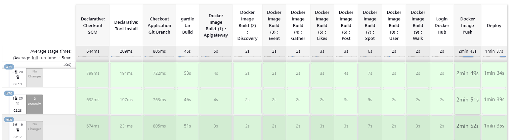

# 배포
> Jenkins를 이용해 이루어 졌으며 https://jenkins.connectus.social 로 접근해 확인 가능합니다. 

<div align="center">
    </img>
</div>

<br><br><br>

# 🧨계정 정보

### SSAFY 계정

```jsx
ID : e106
PW : ssafye106
```

### Root 계정

```jsx
ID : admin
PW : admin
```

<br><br><br>

# 빌드 및 배포 과정
 - [MSA 빌드 과정](https://enchanting-drum-509.notion.site/MS-0b04a5ed99fd47418cc11bb528d4668d?pvs=4)
 - [MSA 수동 배포 과정](https://enchanting-drum-509.notion.site/31c8207f1aef4581b5b9b63ee97f6e8f?pvs=4)

- [MSA 자동 배포 과정](https://enchanting-drum-509.notion.site/CI-CD-7f22e406f8dc47db8dc31d1ec8a7394e?pvs=4)