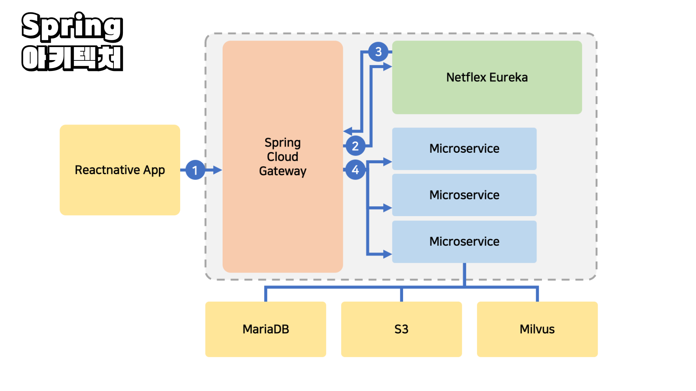
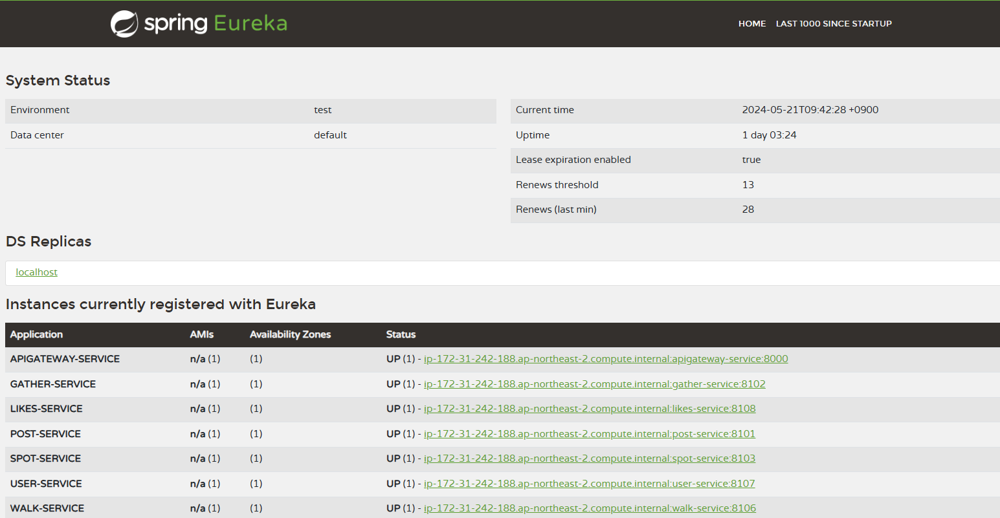
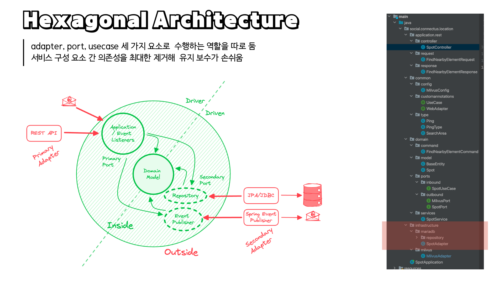

# Spring Service
| MSA 구조로 구성되며 아래의 형식으로 구성되게 되었습니다.

<br>

<div align="center">

## 서비스 흐름

</img>

<table style="width:70%">
    <tr style="text-align: center;">
        <td>순번</td>
        <td>동작</td>
    </tr>
    <tr>
        <td  style="text-align: center;">[1]</td>
        <td>클라이언트의 접근,<br> Spring Cloud Gateway를 이용해 모든 요청에 대한 단일 진입점을 노출하였습니다.</td>
    </tr>
    <tr>
        <td style="text-align: center;">[2]</td>
        <td>Gateway는 Eureka 서비스에 요청</td>
    </tr>
    <tr>
        <td style="text-align: center;">[3]</td>
        <td>사용자의 접근 주소를 기준으로 선언 파일을 참조하여 접근할  Microservice에 대한 정보(포트 및 주소)를 반환</td>
    </tr>
    <tr>
        <td style="text-align: center;">[4]</td>
        <td>Gateway는 반환받은 정보를 통해 최종적으로 서비스에 접근</td>
    </tr>
</table>


<br><br>

## 서비스 구성

<table style="width:70%">
    <tr>
        <td>구성</td>
        <td>역할</td>
    </tr>
    <tr>
        <td>Spring Cloud</td>
        <td>분산 시스템을 구축하고 운영하기 위한 일련의 프레임워크와 라이브러리를 제공</td>
    </tr>
    <tr>
        <td>Netflex Eureka</td>
        <td>Microservice들의 주소, 포트, 연결 설정 값에 대해 정의하고 등록함</td>
    </tr>
    <tr>
        <td>Spring Boot</td>
        <td>각 Microservice에 대해 작성</td>
    </tr>
</table>


<br><br>

## 서비스 역할에 따른 포트 구성

</img>

<table style="width:70%">
    <tr>
        <td>번호</td>
        <td>서비스명</td>
        <td>포트</td>
        <td>비고</td>
    </tr>
    <tr>
        <td>1</td>
        <td>apigateway</td>
        <td>8000</td>
        <td>8761</td>
    </tr>
    <tr>
        <td>2</td>
        <td>discovery</td>
        <td>8761</td>
        <td>api.connectus.social:8761<br> 접근 시 탐색된 서비스 정보 확인 가능</td>
    </tr>
    <tr>
        <td>3</td>
        <td>post</td>
        <td>8101</td>
        <td>방명록</td>
    </tr>
    <tr>
        <td>4</td>
        <td>gather</td>
        <td>8102</td>
        <td>모여라</td>
    </tr>
    <tr>
        <td>5</td>
        <td>spot</td>
        <td>8103</td>
        <td>위치</td>
    </tr>
    <tr>
        <td>6</td>
        <td>chat</td>
        <td>8104</td>
        <td>채팅</td>
    </tr>
    <tr>
        <td>7</td>
        <td>event</td>
        <td>8105</td>
        <td>이벤트</td>
    </tr>
    <tr>
        <td>8</td>
        <td>walk</td>
        <td>8106</td>
        <td>산책</td>
    </tr>
    <tr>
        <td>9</td>
        <td>user</td>
        <td>8107</td>
        <td>유저</td>
    </tr>
    <tr>
        <td>10</td>
        <td>likes</td>
        <td>8108</td>
        <td>좋아요</td>
    </tr>
</table>


<br><br>

## 파일 구조
> Hexagonal Architecture 이용에 따라 복잡한 구조를 지니게 됩니다.

</img>

### 각 서비스는 다음과 같은 구조를 따릅니다.

</div>


```sh
├─java
│  └─social
│      └─connectus
│          └─location
│              ├─application
│              │  └─rest
│              │      ├─controller
│              │      ├─request
│              │      └─response
│              ├─common
│              │  ├─config
│              │  ├─customannotations
│              │  └─type
│              ├─domain
│              │  ├─command
│              │  ├─model
│              │  ├─ports
│              │  │  ├─inbound
│              │  │  └─outbound
│              │  └─services
│              └─infrastructure
│                  ├─mariadb
│                  │  └─repository
│                  └─milvus
└─resources
```